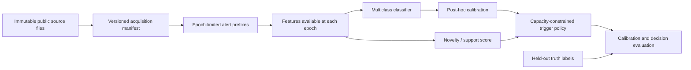

# Architecture

## Purpose and boundary

This repository is deliberately at the research-foundation stage. The package
layout reserves explicit interfaces for a reproducible study but contains no
pipeline, feature, model, calibration, novelty, or policy implementation.
Keeping these boundaries separate is necessary to test whether an apparent
decision improvement arises from probability calibration, distributional novelty,
or an inconsistent evaluation split.

## Planned data flow

The truth-label arrow ends at evaluation. In particular, truth labels must not
be present in feature construction, calibration fitting, or trigger decisions.

## Package responsibilities

| Location | Planned responsibility | Must not do |
| --- | --- | --- |
| `src/aegis/data/` | Acquisition manifests, source validation, object-level splits, and epoch-prefix materialization | Silent download mutation or target leakage |
| `src/aegis/features/` | Transform only epoch-available observations into model inputs | Read future photometry |
| `src/aegis/models/` | Fit and serialize probabilistic multiclass classifiers | Select test hyperparameters |
| `src/aegis/decision/` | Calibrators, novelty/support estimators, capacity-aware policies | Inspect held-out labels |
| `src/aegis/evaluation/` | Fixed metrics, bootstrap intervals, and report tables | Alter policies after evaluation |
| `src/aegis/config/` | Pydantic v2 experiment schemas and validation | Store secrets or raw data |
| `configs/` | Human-reviewed, versioned experiment parameters | Hold credentials |
| `data/` | Ignored downloaded/derived artifacts | Version large source data |

## Reproducibility rules for the implementation phase

1. Split by object before generating epochs, so prefixes from one object never
   cross train/validation/test boundaries.
2. Fit preprocessing, calibration, novelty, and threshold/capacity choices on
   training/validation data only.
3. Make the deployment test population the held-out PLAsTiCC population defined
   in ADR 001; never report a selected-only test score as the headline result.
4. Version the source URL, checksum, parser version, random seed, class mapping,
   epoch grid, capacity grid, and utility-weight sensitivity grid in each run.
5. Preserve raw data immutably and write derived artifacts into run-specific
   paths outside Git.

## Quality gates

`pyproject.toml` defines Python 3.12+, uv dependency management, Ruff, mypy,
pytest with coverage, and Pydantic v2. The pre-commit configuration and GitHub
Actions workflow run formatting, linting, type checking, and tests. The CI job
uses the committed `uv.lock`; changes to dependencies must update that lockfile.
